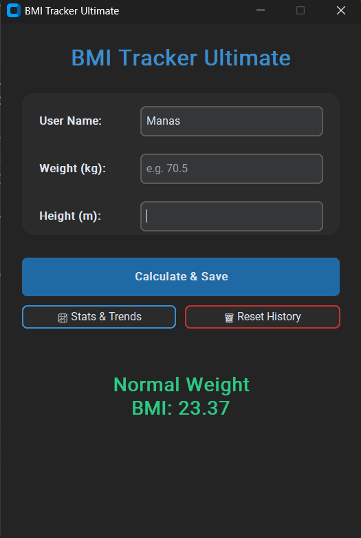

🏥 BMI Tracker Ultimate

A modern, desktop-based Body Mass Index (BMI) calculator and health tracker built with Python.

This application allows users to calculate their BMI, categorize it (Underweight, Normal, Overweight, Obese), save their history to a local database, and visualize their health trends over time.

✨ Features

Advanced GUI: Built with CustomTkinter for a professional, dark-mode interface.

Data Persistence: Uses SQLite to automatically save user history.

Smart Visualizations: Interactive Matplotlib graphs with color-coded health zones.

Statistical Analysis: Automatically calculates Average, Max, and Min BMI.

Multi-User Support: Track history for different users independently.

Input Validation: robust error handling prevents crashes on invalid inputs.

🚀 Installation

Clone the repository

git clone https://github.com/Manas050606/OIBSIP-BMI-Calculator.git

cd BMI-Tracker

Install dependencies

pip install -r requirements.txt

Run the App

python bmi.py

🛠 Tech Stack

Python 3.10+

CustomTkinter (Modern UI Framework)

Matplotlib (Data Visualization & Graphing)

SQLite3 (Built-in Database)

📸 How to Use

            

Enter Data: Type a unique User Name, Weight (kg), and Height (m).

Calculate: Click Calculate & Save. The app will display your BMI and category immediately.

View Trends: Click Stats & Trends to see a graph of your progress over time, including your average and highest/lowest records.

Reset: Use the Reset History button to clear data for a specific user.
